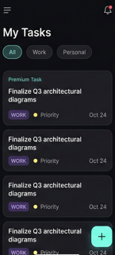

# Smart Site Task Manager

All-in-one task management system with a Flutter client and a Node.js/Express API. It analyzes free‑form text, auto‑classifies tasks, assigns priority, extracts entities, and maintains an audit trail.

## Overview
- Cross-platform Flutter app built with Riverpod, `Dio`, and a dark, modern UI
- Backend API on Express.js with PostgreSQL (Supabase), Zod validation, and robust error handling
- Automatic classification, priority detection, entity extraction, and suggested actions
- Pagination, filtering, and a detailed task overview with audit history

## Repository Structure
```
Smart Site Task Manager/
├── Backend/            # Node.js Express API
│   └── src/            # Controllers, services, routes, models, middlewares
├── Frontend/           # Flutter app (Riverpod)
│   ├── lib/            # App code: features, core, providers, UI
│   └── web/            # PWA assets for Flutter web
└── docs/
    └── images/         # UI screenshots used below
```

## UI Screens
- Create Task
  - `docs/images/create-task.png`
- My Tasks
  - `docs/images/my-tasks.png`
- Classification Preview
  - `docs/images/classification-preview.png`
- Task Overview
  - `docs/images/task-overview.png`

Embed examples:


## Quick Start

### Backend (API)
- Requirements: Node.js v18+, PostgreSQL/Supabase
- Install: `cd Backend && npm install`
- Configure environment:
  - `PORT`, `NODE_ENV`, `DATABASE_URL`, `SUPABASE_URL`, `SUPABASE_KEY`, `API_KEY`, `RATE_LIMIT_*`, `ALLOWED_ORIGINS`
- Run dev: `npm run dev`
- Tests: `npm test`
- Health: `GET http://localhost:3000/health`
- Deployed Link: [https://smart-site-task-manager-e5op.onrender.com]

Key routes are registered in `Backend/src/app.js:118` and defined in `Backend/src/routes/taskRoutes.js:32`.

### Frontend (Flutter)
- Requirements: Flutter SDK 3.x
- Install: `cd Frontend && flutter pub get`
- Configure `Frontend/.env` (see `Frontend/.env.example`):
  - `API_BASE_URL`, `API_KEY`
  - Android emulator `API_BASE_URL`: `http://10.0.2.2:3000`
  - iOS simulator: `http://localhost:3000`
  - Physical device: `http://<your-lan-ip>:3000`
- Run app: `flutter run`
- Analyze: `flutter analyze`
- Tests: `flutter test`

The app loads env early in `Frontend/lib/main.dart:8` and configures a singleton HTTP client in `Frontend/lib/core/network/dio_client.dart:10`.

## Features
- Task creation from natural language with one-tap analysis
  - UI logic: `Frontend/lib/features/tasks/presentation/create_task_screen.dart:25` and button at `:115`
- Live task list with filtering, swipe-to-delete, undo
  - UI: `Frontend/lib/features/tasks/presentation/home_screen.dart:51` and FAB at `:212`
- Classification preview with category, priority, entities, and suggested actions
  - UI: `Frontend/lib/features/tasks/presentation/classification_preview_screen.dart:32`
- Detailed task view with metadata and audit history
  - UI: `Frontend/lib/features/tasks/presentation/task_detail_screen.dart:14`
- Secure API with API key auth, rate limiting, validation, and structured responses
  - Auth middleware: `Backend/src/middlewares/auth.js:12`
  - Error handling: `Backend/src/middlewares/errorHandler.js`
  - Response format: see `Backend/README.md`

## API Summary
- Base URL (local): `http://localhost:3000`
- Auth header: `X-API-Key: <your_api_key>`
- Endpoints (see `Backend/README.md` for bodies and responses):
  - `POST /api/tasks` — create and auto-classify
  - `GET /api/tasks` — list with filters, pagination
  - `GET /api/tasks/:id` — fetch one with history
  - `PATCH /api/tasks/:id` — update, re-classifies when text changes
  - `DELETE /api/tasks/:id` — delete
  - `GET /api/tasks/stats` — stats

Classification rules live in `Backend/src/services/classificationService.js:90`, including keyword maps, priority detection, entity extraction, and action suggestions.

#UI Screenshots
UI screenshots used in the root `README.md` should be saved here with these filenames:

- `home-page.png`

- `create-task.png`

- `classification-preview.png`

- `task-overview.png`


Place your images in this folder so Markdown links resolve.


## Configuration
- Frontend `.env`
  - `API_BASE_URL` — backend URL per platform
  - `API_KEY` — same value as backend
- Backend `.env`
  - `API_KEY` — required and validated in `auth.js`
  - `DATABASE_URL`, `SUPABASE_URL`, `SUPABASE_KEY` — Postgres/Supabase
  - `ALLOWED_ORIGINS` — comma-separated CORS origins
  - `RATE_LIMIT_WINDOW_MS`, `RATE_LIMIT_MAX_REQUESTS`

## Development
- Conventional commits (see `Backend/README.md`)
- Error responses are standardized and logged; see `Backend/src/app.js:143`
- The Flutter theme and UI components live under `Frontend/lib/core/theme` and `Frontend/lib/features/tasks/presentation/*`

## Deployment
- Backend: Render.com, build `npm install`, start `npm start` (guide in `Backend/README.md`)
- Frontend: Flutter
  - Web: `flutter build web` outputs to `Frontend/build/web`
  - Mobile: `flutter build apk` / `flutter build ios`

## Troubleshooting
- Emulator cannot reach API
  - Use platform-specific base URLs shown above
  - Confirm backend health at `/health`
- 401 Authentication
  - Ensure `API_KEY` is set on both sides and passed in `X-API-Key`
- CORS errors
  - Set `ALLOWED_ORIGINS` in backend `.env`

## License
- Frontend includes `MIT` license (`Frontend/LICENSE`)
- You can license the entire monorepo under MIT or your chosen license

## Acknowledgments
- Built for Navicon Infraprojects internship assessment