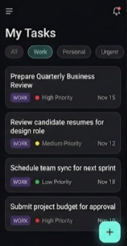
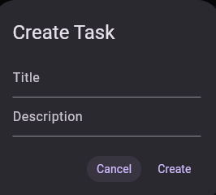
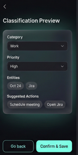
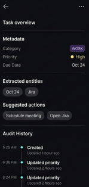

# Smart Site Task Manager

All-in-one task management system with a Flutter client and a Node.js/Express API. It analyzes free‑form text, auto‑classifies tasks, assigns priority, extracts entities, and maintains an audit trail.

# Project Overview

The Smart Site Task Manager allows users to create tasks using natural language.
The system automatically:
Detects task category (scheduling, finance, technical, safety, general)
Assigns priority (high / medium / low)
Extracts entities (people, dates, keywords)
Suggests next actions
Maintains a complete audit history

Example input
"Schedule urgent meeting with team today about budget allocation"

System output
Category: scheduling
Priority: high
Entities: team, today, budget
Suggested actions: Block calendar, Send invite, Prepare agenda

# Tech Stack

Backend
Node.js (v18+)
Express.js
PostgreSQL (Supabase)
Zod (validation)
Jest + Supertest (testing)
API Key authentication
Rate limiting & structured error handling
Deployed on Render

Frontend
Flutter (Material Design 3)
Riverpod (state management)
Dio (networking)
Dark modern UI
Offline & error-aware UX
## Submission Checklist
- ✔ Live backend URL: https://smart-site-task-manager-e5op.onrender.com
- ✔ 5 API endpoints implemented
- ✔ Flutter app usable for demo
- ✔ 3+ backend tests included
- ✔ Screenshots embedded in README

## Overview
- Cross-platform Flutter app built with Riverpod, `Dio`, and a dark, modern UI
- Backend API on Express.js with PostgreSQL (Supabase), Zod validation, and robust error handling
- Automatic classification, priority detection, entity extraction, and suggested actions
- Pagination, filtering, and a detailed task overview with audit history

## Repository Structure
```
Smart Site Task Manager/
├── Backend/            # Node.js Express API
│   └── src/            # Controllers, services, routes, models, middlewares
├── Frontend/           # Flutter app (Riverpod)
│   ├── lib/            # App code: features, core, providers, UI
│   └── web/            # PWA assets for Flutter web
└── docs/
    └── images/         # UI screenshots used below
```

## UI Screens

 filenames:
- `home-page.png`

- `create-task.png`

- `classification-preview.png`

- `task-overview.png`


## Quick Start

### Backend (API)
- Requirements: Node.js v18+, PostgreSQL/Supabase
- Install: `cd Backend && npm install`
- Configure environment:
  - `PORT`, `NODE_ENV`, `DATABASE_URL`, `SUPABASE_URL`, `SUPABASE_KEY`, `API_KEY`, `RATE_LIMIT_*`, `ALLOWED_ORIGINS`
- Run dev: `npm run dev`
- Tests: `npm test`
- Health: `GET http://localhost:3000/health`
- Deployed Link: [https://smart-site-task-manager-e5op.onrender.com]

Key routes are registered in `Backend/src/app.js:118` and defined in `Backend/src/routes/taskRoutes.js:32`.

### Frontend (Flutter)
- Requirements: Flutter SDK 3.x
- Install: `cd Frontend && flutter pub get`
- Configure `Frontend/.env` (see `Frontend/.env.example`):
  - `API_BASE_URL`, `API_KEY`
  - Android emulator `API_BASE_URL`: `http://10.0.2.2:3000`
  - iOS simulator: `http://localhost:3000`
  - Physical device: `http://<your-lan-ip>:3000`
- Run app: `flutter run`
- Analyze: `flutter analyze`
- Tests: `flutter test`

The app loads env early in `Frontend/lib/main.dart:8` and configures a singleton HTTP client in `Frontend/lib/core/network/dio_client.dart:10`.

## Features
- Task creation from natural language with one-tap analysis
  - UI logic: `Frontend/lib/features/tasks/presentation/create_task_screen.dart:25` and button at `:115`
- Live task list with filtering, swipe-to-delete, undo
  - UI: `Frontend/lib/features/tasks/presentation/home_screen.dart:51` and FAB at `:212`
- Classification preview with category, priority, entities, and suggested actions
  - UI: `Frontend/lib/features/tasks/presentation/classification_preview_screen.dart:32`
- Detailed task view with metadata and audit history
  - UI: `Frontend/lib/features/tasks/presentation/task_detail_screen.dart:14`
- Secure API with API key auth, rate limiting, validation, and structured responses
  - Auth middleware: `Backend/src/middlewares/auth.js:12`
  - Error handling: `Backend/src/middlewares/errorHandler.js`
  - Response format: see `Backend/README.md`


## API Summary
- Base URL (local): `http://localhost:3000`
- Auth header: `X-API-Key: <your_api_key>`
- Endpoints (see `Backend/README.md` for bodies and responses):
  - `POST /api/tasks` — create and auto-classify
  - `GET /api/tasks` — list with filters, pagination
  - `GET /api/tasks/:id` — fetch one with history
  - `PATCH /api/tasks/:id` — update, re-classifies when text changes
  - `DELETE /api/tasks/:id` — delete
  - `GET /api/tasks/stats` — stats

Classification rules live in `Backend/src/services/classificationService.js:90`, including keyword maps, priority detection, entity extraction, and action suggestions.

## API Documentation
- Authentication
  - Send `X-API-Key: <your_api_key>` on every request
  - Optional: `Authorization: Bearer <your_api_key>` is also supported
- Create Task — POST `/api/tasks`

Headers:
```
X-API-Key: abc123
Content-Type: application/json
```

Body:
```json
{
  "title": "Schedule urgent meeting with team today about budget",
  "description": "Discuss Q4 budget with finance and operations",
  "assigned_to": "John Doe",
  "due_date": "2025-12-27T10:00:00Z"
}
```

Response (201):
```json
{
  "success": true,
  "data": {
    "task": {
      "id": "550e8400-e29b-41d4-a716-446655440000",
      "title": "Schedule urgent meeting with team today about budget",
      "description": "Discuss Q4 budget with finance and operations",
      "category": "scheduling",
      "priority": "high",
      "status": "pending",
      "assigned_to": "John Doe",
      "due_date": "2025-12-27T10:00:00.000Z",
      "extracted_entities": {
        "people": ["John"],
        "dates": ["today"],
        "keywords": ["meeting", "team", "budget"]
      },
      "suggested_actions": ["Block calendar","Send invite","Prepare agenda","Set reminder"],
      "created_at": "2025-12-26T10:30:00.000Z",
      "updated_at": "2025-12-26T10:30:00.000Z"
    }
  },
  "message": "Task created successfully"
}
```

- List Tasks — GET `/api/tasks`

Query params:
- `status`: `pending` | `in_progress` | `completed`
- `category`: `scheduling` | `finance` | `technical` | `safety` | `general`
- `priority`: `high` | `medium` | `low`
- `search`: free text
- `sortBy`: default `created_at`
- `sortOrder`: `asc` | `desc` (default: `desc`)
- `limit`: default `10` (max `100`)
- `offset`: default `0`

Example:
```
GET /api/tasks?status=pending&category=scheduling&priority=high&limit=5&offset=0
```

Response (200):
```json
{
  "success": true,
  "data": {
    "tasks": [],
    "pagination": { "total": 0, "limit": 5, "offset": 0, "totalPages": 0, "currentPage": 1, "hasNext": false, "hasPrevious": false }
  }
}
```

- Get Task — GET `/api/tasks/:id`
```json
{
  "success": true,
  "data": {
    "task": { "id": "<uuid>", "title": "...", "category": "scheduling", "priority": "high", "status": "in_progress" },
    "history": [{ "action": "created", "changed_by": "system", "changed_at": "..." }]
  }
}
```

- Update Task — PATCH `/api/tasks/:id`
```json
{ "status": "in_progress", "assigned_to": "Jane Smith" }
```
Response (200):
```json
{
  "success": true,
  "data": { "task": { "id": "<uuid>", "status": "in_progress", "assigned_to": "Jane Smith" } },
  "message": "Task updated successfully"
}
```

- Delete Task — DELETE `/api/tasks/:id`
Response (200):
```json
{ "success": true, "message": "Task deleted successfully" }
```

- Statistics — GET `/api/tasks/stats`
Response (200):
```json
{
  "success": true,
  "data": {
    "counts": { "pending": 12, "in_progress": 4, "completed": 30 },
    "byCategory": { "scheduling": 10, "finance": 6, "technical": 8, "safety": 2, "general": 20 }
  }
}
```

- Error Responses
  - 401 Authentication
    ```json
    { "success": false, "error": { "code": "AUTHENTICATION_ERROR", "message": "Invalid API key" } }
    ```
  - 400 Validation
    ```json
    { "success": false, "error": { "code": "VALIDATION_ERROR", "message": "Validation failed", "details": [] } }
    ```
  - 404 Not Found
    ```json
    { "success": false, "error": { "code": "NOT_FOUND", "message": "Resource not found" } }
    ```

For implementation, see [taskRoutes.js](file:///d:/Projects/Smart%20Site%20Task%20Manager/Backend/src/routes/taskRoutes.js) and [app.js](file:///d:/Projects/Smart%20Site%20Task%20Manager/Backend/src/app.js).

## Configuration
- Frontend `.env`
  - `API_BASE_URL` — backend URL per platform
  - `API_KEY` — same value as backend
- Backend `.env`
  - `API_KEY` — required and validated in `auth.js`
  - `DATABASE_URL`, `SUPABASE_URL`, `SUPABASE_KEY` — Postgres/Supabase
  - `ALLOWED_ORIGINS` — comma-separated CORS origins
  - `RATE_LIMIT_WINDOW_MS`, `RATE_LIMIT_MAX_REQUESTS`

## Unit Tests & Coverage
- Tests file: [task.test.js](file:///d:/Projects/Smart%20Site%20Task%20Manager/Backend/src/tests/task.test.js)
- Scenarios covered:
  - Task creation with automatic classification
  - GET with filters and pagination
  - Update and delete flows
- Run tests with coverage:
  - `cd Backend && npm test`
  - HTML report: `Backend/coverage/lcov-report/index.html`
- Example summary:
```
Test Suites: all passed
Tests:      creation/classification, list filters, update, delete, health
Coverage:   statements, branches, functions, lines reported in coverage/
```

## Development
- Conventional commits (see `Backend/README.md`)
- Error responses are standardized and logged; see `Backend/src/app.js:143`
- The Flutter theme and UI components live under `Frontend/lib/core/theme` and `Frontend/lib/features/tasks/presentation/*`

## Requirements Status
- Backend with 5 REST APIs — ✅ Present
- Auto classification & priority detection — ✅ Present
- Live deployment — ✅ Present
- Flutter app with core screens — ✅ Present
- Screenshots in README — ✅ Present

## Deployment
- Backend: Render.com, build `npm install`, start `npm start` (guide in `Backend/README.md`)
- Frontend: Flutter
  - Web: `flutter build web` outputs to `Frontend/build/web`
  - Mobile: `flutter build apk` / `flutter build ios`

## Flutter + Live Backend (Demo)
- Set `Frontend/.env` to your live URL:
  - `API_BASE_URL=https://smart-site-task-manager-e5op.onrender.com`
  - `API_KEY=OD24formeAPIKey!` (for testing the deployed Backend)
- Run `flutter run`
- Confirm:
  - Create task → Classification preview shows category/priority/entities
  - My Tasks list loads from live backend

## Troubleshooting
- Emulator cannot reach API
  - Use platform-specific base URLs shown above
  - Confirm backend health at `/health`
- 401 Authentication
  - Ensure `API_KEY` is set on both sides and passed in `X-API-Key`
- CORS errors
  - Set `ALLOWED_ORIGINS` in backend `.env`

## License
- Frontend includes `MIT` license (`Frontend/LICENSE`)
- You can license the entire monorepo under MIT or your chosen license